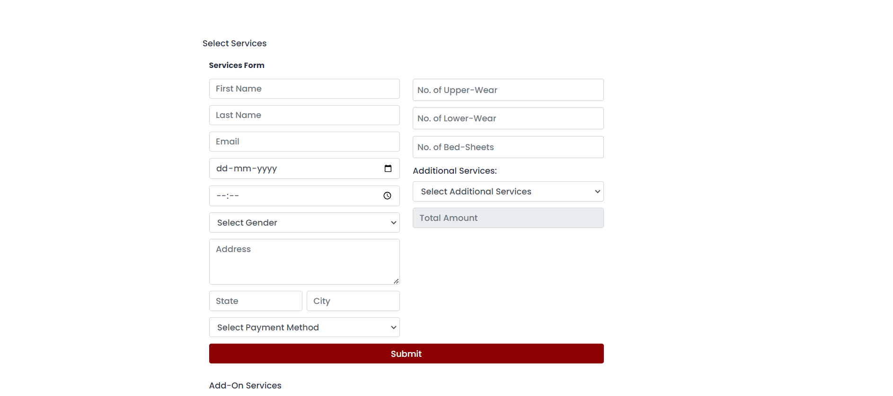
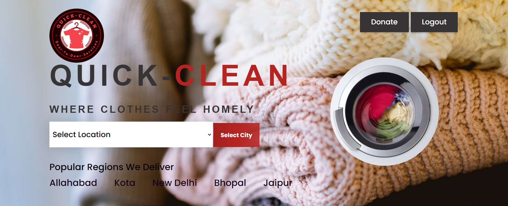
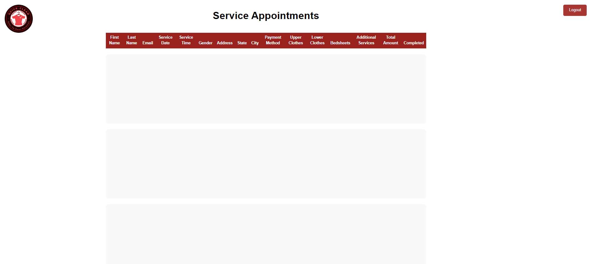

# 🧺 Laundry Management System

## 📋 Objective
The objective of this project is to develop a comprehensive system for managing laundry operations efficiently.

## 🚀 Features
- **User Registration and Authentication**: Secure login for customers and staff.
- **Order Placement, Tracking, and Management**: Easily place, track, and manage laundry orders.
- **Geolocation-Based System**: Ideal for new users in unfamiliar places who need laundry services.
- **Reporting and Analytics**: Gain valuable business insights through detailed reports.

## 🛠️ Technologies Used
- **HTML**
- **CSS**
- **JavaScript**
- **Firebase**

## 📍 Geolocation-Based System
If you are new to any place and need laundry services, this application is incredibly useful. The geolocation feature helps you find the nearest laundry service available.

## 🔧 Installation
1. Clone the repository:
   ```bash
   git clone https://github.com/yourusername/laundry-management-system.git

   ## 📷 Screenshots




